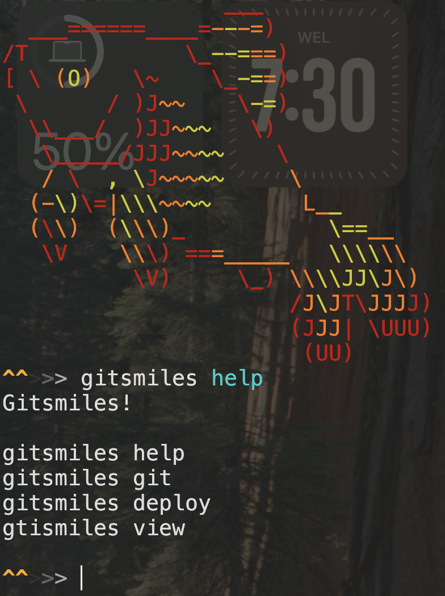

<div align=center>
<h1> GitSmiles </h1>



</div>

## About
Gitsmiles is a `python` powered project that originated from Angstrom Nitro.
Originally it started out as deployment tools,
then I realised that I could just stick a `CLI` on-top of it and call it a day!

## Install
Requirements:
 - python3 `brew install python3`
 - A functional shell

```bash
git clone https://github.com/rhhen122/gitsmiles.git ~/gitsmiles/
~/gitsmiles/gitsmiles.sh install
```

<details><summary>Bash</summary>
Add the following to your `.bashrc` file to make it run on startup

```bash
export PATH=$PATH:~/gitsmiles/
```
</details>
<details><summary>Zsh</summary>
Add the following to your `.zshrc` file to make it run on startup

```bash
export PATH=$PATH:~/gitsmiles/
```
</details>
<details><summary>Fish</summary>
Run the following

```bash
fish_add_path ~/gitsmiles/
