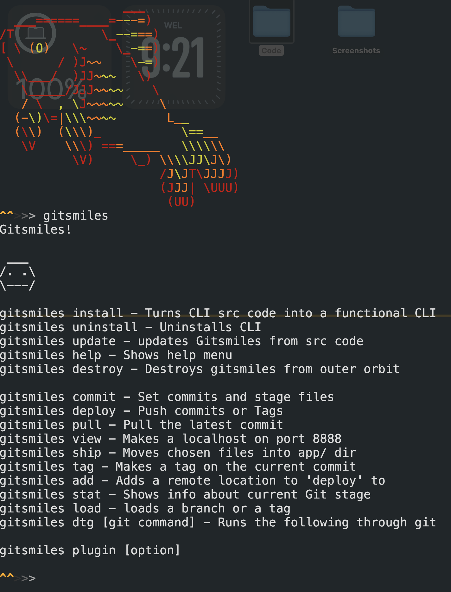

<div align=center>
<h1> GitSmiles </h1>



</div>

## About
Gitsmiles is a `python` powered project that originated from Angstrom Nitro.
Originally it started out as deployment tools,
then I realised that I could just stick a `CLI` on-top of it and call it a day!

## Install
```bash
./gitsmiles.sh install
```

Then add `~/gitsmiles/` to your shells $PATH
